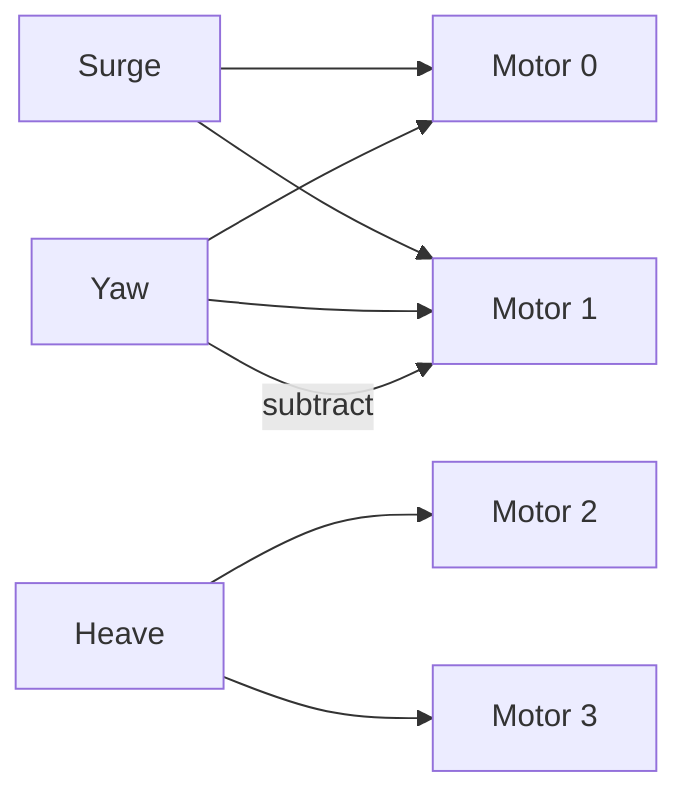

# Control Allocation and Mixing

Control allocation maps desired forces and torques to actuator commands. This is the step that turns controller outputs into per-motor signals.

## Why Allocation Matters

- Multi-actuator vehicles are over- or under-actuated.
- Saturation can break attitude control.
- Constraints like max thrust, direction limits, and dead zones must be enforced.

## Simple Mixing (ROV Example)

The current ROV controller in `src/controllers/rov_controller.cpp` uses a direct mixing strategy:

```
Surge + Yaw -> horizontal thrusters
Heave       -> vertical thrusters
```



This is fast and predictable but does not account for saturation or actuator limits beyond simple clamping.

## General Allocation with Matrices

For more complex vehicles, you define:

- `tau` as desired forces/torques.
- `A` as the allocation matrix mapping motor commands to forces.

```
A * u = tau
```

Then solve for `u` subject to constraints.

Common approaches:

- Pseudoinverse for least-squares allocation.
- Constrained optimization for actuator limits.
- Priority-based allocation to preserve attitude control.

## Coupling to This Framework

Where to extend:

- Add a new controller that outputs a `tau` vector.
- Add a mixer module that takes `tau` and produces `ControlOutput`.
- Keep `IActuatorOutput` unchanged so outputs remain normalized.

Suggested structure:

```
Controller -> Allocation -> ControlOutput -> ActuatorOutput
```

## Implementation Hook

You can keep the existing controller interface and replace the internal mixing with an allocation step:

```cpp
// New mixer class
ControlOutput Allocate(const Tau& tau, const AllocationConfig& cfg);
```

Then call it inside your controller's `Update()`.
