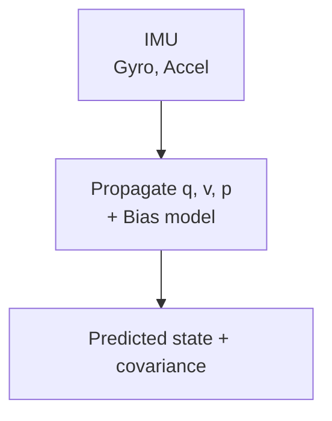
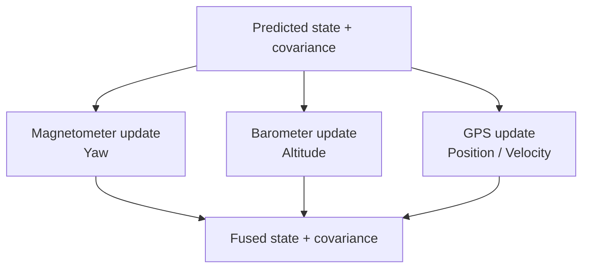

# EKF Sensor Fusion: Beyond Basic AHRS

This guide covers how to extend beyond AHRS into a full state estimator that fuses IMU, magnetometer, barometer, and GPS. It also outlines how to connect these concepts to the estimator interface in this framework.

## Why Use an EKF

An Extended Kalman Filter (EKF) lets you combine fast, noisy sensors with slow, drift-free sensors. It provides:

- Stable attitude and position with bounded drift.
- Consistent state estimates and uncertainty values.
- A clean way to add new sensors without rewriting the estimator.

## State Design

A typical multicopter EKF state might include:

- Orientation quaternion `q`
- Velocity `v`
- Position `p`
- Gyro bias `b_g`
- Accel bias `b_a`

That gives a 15-state system. A simpler ROV or fixed-wing can omit some terms.

## Prediction Step (IMU Integration)

The EKF prediction integrates IMU data at high rate.

- Gyro integrates quaternion dynamics.
- Accel is rotated into world frame to update velocity and position.
- Bias terms are modeled as random walk.



## Update Step (GPS/Baro/Mag)

Each sensor contributes a measurement model.

- Magnetometer: heading correction.
- Barometer: altitude correction.
- GPS: absolute position and velocity.



## Error-State vs Full-State

Many flight stacks use an error-state EKF because it keeps the nominal state on the manifold (unit quaternion) and estimates small error deltas. Advantages:

- Quaternion normalization issues are minimized.
- Covariance stays consistent for rotations.

## Practical Implementation Notes

- Use consistent frames. Decide on NED or ENU and stick with it.
- Normalize accelerometer and magnetometer for the correction step.
- Constrain covariance growth to prevent divergence.
- Watch out for GPS latency; time-align measurements when possible.

## Coupling to This Framework

The estimator interface is defined in `include/flight/estimators/estimators.h`. A new EKF would implement `IStateEstimator` and populate `EstimatorOutput`.

Suggested integration points:

- Create `include/flight/estimators/ekf.h` and `src/estimators/ekf.cpp`.
- Use `EstimatorInput` to carry IMU, mag, baro, and GPS samples.
- Update `EstimatorOutput::pose` with orientation, velocity, and position.

Example scaffold:

```cpp
class EkfEstimator final : public IStateEstimator {
 public:
  bool Initialize() override;
  EstimatorOutput Update(const EstimatorInput& input) override;

 private:
  EstimatorOutput state_{};
  // Add EKF state, covariance, and bias models here.
};
```

## Why This Matters Here

The current Madgwick filter in `src/estimators/madgwick.cpp` handles attitude only. EKF is the path to:

- True position hold using GPS or baro.
- Stable heading in magnetically noisy environments.
- Fusing more sensors without re-architecting the control loop.
