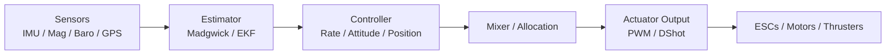

# Theory to Practice: Coupling Concepts to This Framework

This final section ties the theory from the advanced guides directly to the implementation you have in this repository. The goal is to make each abstract concept visible in concrete code and data flow.

## End-to-End Data Flow



## Where Each Stage Lives in Code

- Estimator interface: `include/flight/estimators/estimators.h`
- Madgwick implementation: `src/estimators/madgwick.cpp`
- Controller interface: `include/flight/controllers/controllers.h`
- ROV mixer/controller: `src/controllers/rov_controller.cpp`
- Actuator interface: `include/flight/actuators/actuators.h`
- PWM output: `src/actuators/biheli_pwm_output.cpp`
- Vehicle orchestration: `src/vehicle/rov4_vehicle.cpp`

## Concrete Example: ROV Control Loop

The ROV vehicle pulls everything together. A simplified view of `src/vehicle/rov4_vehicle.cpp`:

```cpp
estimators::EstimatorInput input;
const auto estimate = deps_.estimator->Update(input);

controllers::ControlSetpoint setpoint{};
if (deps_.receiver) {
  const auto frame = deps_.receiver->Read();
  if (frame && frame->channel_count >= 3) {
    setpoint.velocity_mps.x = frame->channels[0];
    setpoint.body_rates_rps.z = frame->channels[1];
    setpoint.velocity_mps.z = frame->channels[2];
  }
}

auto output = deps_.controller->Update(estimate.pose, setpoint, dt_s);

actuators::ActuatorCommand commands[4];
for (uint8_t i = 0; i < 4; ++i) {
  commands[i].value = output.motors[i];
}

deps_.actuators->Write(commands, 4);
```

This matches the theory exactly:

- Estimator produces pose.
- Controller uses setpoint and pose to compute motor commands.
- Actuator output converts commands to ESC signals.

## Example: Mixer / Allocation in This Repo

The ROV mixer currently uses a simple allocation strategy:

```cpp
// src/controllers/rov_controller.cpp
output.motors[0] = Clamp(surge + yaw, -1.0f, 1.0f);
output.motors[1] = Clamp(surge - yaw, -1.0f, 1.0f);
output.motors[2] = Clamp(heave, -1.0f, 1.0f);
output.motors[3] = Clamp(heave, -1.0f, 1.0f);
```

This is a direct, interpretable mixing matrix. It is the best place to insert control allocation logic if you move to more complex vehicles.

## Example: Actuator Mapping

The PWM output maps normalized commands to pulses:

```cpp
// src/actuators/biheli_pwm_output.cpp
const float pulse = config_.neutral_pulse_us + (value * range);
```

This shows the exact place to apply:

- Thrust curve linearization.
- DShot digital encoding (in a new actuator class).
- Rate limiting or smoothing.

## Example: Estimator Update

The Madgwick estimator in `src/estimators/madgwick.cpp` already demonstrates key estimator behavior:

- Quaternion integration from gyro.
- Correction from accelerometer and optional magnetometer.
- Normalization and dt checks.

This is the best place to study how estimator math translates to code and to evolve toward EKF.

## Suggested Extension Path

1. Implement a full EKF in `src/estimators/ekf.cpp`.
2. Add a new controller for attitude or position hold.
3. Introduce a general allocation module and reuse it across vehicles.
4. Add DShot output in `src/actuators/dshot_output.cpp` and wire it to the vehicle.

## Final Thought

The framework already reflects the canonical architecture used by most modern flight controllers. With these advanced topics mapped to actual files, you can build a tight feedback loop between theory and implementation, which is exactly what makes systems like this teachable and robust.
