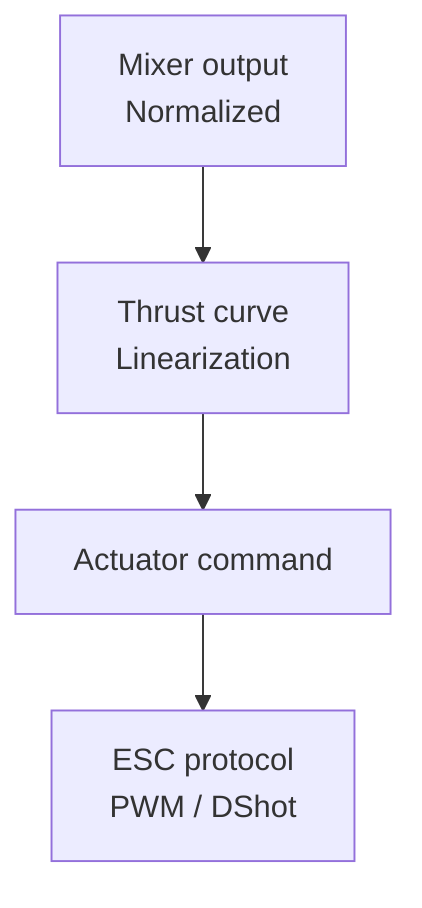

# Motor and Propeller Modeling

This guide covers thrust modeling, non-linearities, and how that affects mixers and actuator outputs.

## Why Motor Modeling Matters

Real motors are not linear:

- Thrust is roughly proportional to the square of RPM.
- ESCs may include deadzones and non-linear throttle mapping.
- Battery voltage sag reduces available thrust.

Ignoring these effects creates tuning surprises and limits performance.

## The Thrust Curve

A common approximation for prop thrust:

```
T = k_t * (RPM^2)
```

A practical controller often works in normalized commands `u` and uses a calibration curve:

```
T = a*u^2 + b*u + c
```

## Saturation and Headroom

If the mixer demands more thrust than available, outputs saturate. This affects yaw and attitude authority. Good controllers maintain headroom:

- Limit total thrust to preserve control authority.
- Scale attitude corrections under heavy load.

## ESC Protocol Effects

Signal type affects latency and quantization:

- PWM: slow update, coarse timing.
- OneShot/MultiShot: faster, still analog.
- DShot: digital, consistent, faster command cycles.

These directly influence the closed-loop bandwidth you can achieve.

## Coupling to This Framework

The framework already abstracts actuators with normalized commands in `include/flight/actuators/actuators.h`.

The ROV mixer writes `[-1, 1]` commands in `src/controllers/rov_controller.cpp`. The actuator output maps these to PWM in `src/actuators/biheli_pwm_output.cpp`.

Core snippet:

```cpp
// src/controllers/rov_controller.cpp
output.motors[0] = Clamp(surge + yaw, -1.0f, 1.0f);
```

```cpp
// src/actuators/biheli_pwm_output.cpp
const float pulse = config_.neutral_pulse_us + (value * range);
```

This means:

- You can insert a thrust curve before `Write()` to linearize thrust.
- You can scale commands to reserve headroom for control.

## Suggested Enhancement Path

- Add a thrust curve function in the controller or actuator layer.
- Calibrate each motor and store coefficients in a config file.
- Use a simple lookup table for runtime speed.


