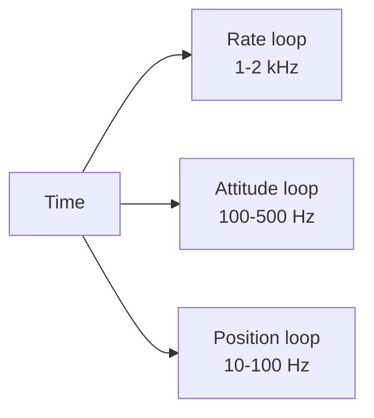

# Real-Time Scheduling and Timing Budgets

Timing is a hidden source of instability. Even if your math is correct, jitter and late updates can make a vehicle feel “loose” or oscillatory.

## Typical Loop Rates

- IMU sampling: 1–8 kHz
- Rate control: 500–2000 Hz
- Attitude control: 100–500 Hz
- Position control: 10–100 Hz
- Actuator output: 50–2000 Hz

## Jitter and Latency

A control loop expects a consistent `dt`. If `dt` varies:

- Integration errors accumulate.
- Derivative terms amplify noise.
- Estimator updates become inconsistent.

## Budgeting CPU Time

A rule of thumb:

- Each loop should use less than 30% of its time budget.
- The remaining time covers interrupt load and worst-case spikes.

Example:

```
Rate loop at 1 kHz -> 1.0 ms budget
Target execution    -> 0.3 ms
Slack               -> 0.7 ms
```

## Coupling to This Framework

This repo includes a scheduler subsystem. The docs and code in `docs/` and `src/` mention mixed-rate loops. A typical integration pattern is:

- Fast loop: estimator + rate controller
- Mid loop: attitude controller
- Slow loop: position or navigation controller

You can implement this by:

- Running `Update()` functions at different intervals.
- Passing the measured `dt` to each control layer.

## Practical Recommendation

If you only run one loop at first, measure `dt` and clamp extreme values. The Madgwick estimator already does this with a max dt check in `src/estimators/madgwick.cpp`.


