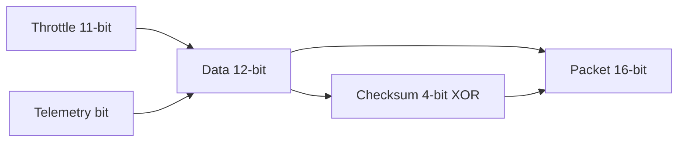
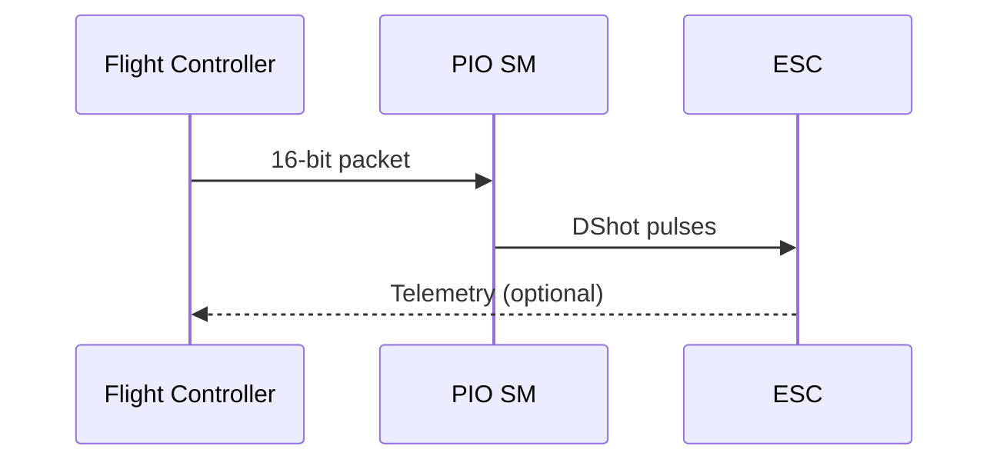

# RP2350 DShot Integration

This guide focuses on RP2350 specifics and how to build a robust DShot output path using PIO. It ties the electrical protocol to the concrete interfaces in this repository.

## Why RP2350 + PIO Is a Good Fit

- DShot needs tight, deterministic timing.
- PIO runs independently of CPU load and interrupts.
- DMA can stream packets into PIO for multi-channel updates.

## DShot Packet Format (16-bit)

- 11 bits: throttle (0–2047)
- 1 bit: telemetry request
- 4 bits: checksum (XOR of data nibbles)

Mermaid overview:

## Timing Model

DShot bit timing varies by speed. At DShot300:

- Bit time ~3.33 microseconds
- High time depends on 0/1 symbol

Mermaid timing concept:

## Recommended RP2350 Implementation Plan (DShot300)

1. Encode normalized commands to DShot packets.
2. Push packets into a PIO state machine.
3. Use DMA for multi-channel updates at fixed rate.
4. Synchronize with the control loop to avoid jitter.

## Configuration (Pins, Channels, Telemetry)

The RP2350 output scaffold exposes a configuration struct:

- `channel_count`: number of active channels (up to 4, one PIO state machine per channel).
- `pins[]`: explicit GPIO pin mapping per channel.
- `speed`: set to DShot300 by default.
- `enable_telemetry`: optional telemetry bit.

This lets you map outputs to any GPIOs without relying on a contiguous pin base. The current implementation uses one PIO state machine per channel, so it is limited to 4 channels per PIO instance.

Telemetry capture uses a separate PIO instance by default (`pio_index = 1`) to avoid state machine conflicts with the DShot output path.

## DShot600 Validation

The initializer validates that the PIO clock divider remains >= 1.0 at the selected speed. This keeps DShot600 (and above) from silently running with invalid timing on slower clocks.

## Telemetry Capture (PIO Sampling)

Telemetry receive support is implemented as a PIO sampling pipeline:

- A tiny PIO program samples the pin at `dshot_khz * samples_per_bit`.
- Samples are pushed into the RX FIFO as 32-bit words.
- `Read()` returns the most recent raw sample word (lower 16 bits).

This provides a concrete capture path and a place to add proper telemetry decoding and CRC checks. A basic bit-window decoder is implemented and returns a 16-bit raw frame; CRC validation is implemented and exposed as `crc_ok`.

## Where This Connects in the Repo

- Encoder placeholder: `src/actuators/dshot_output.cpp`
- RP2350 PIO scaffold: `src/pico/rp2350_dshot_pio_output.cpp`
- Actuator interface: `include/flight/actuators/actuators.h`

## Current Status

The RP2350 DShot path is scaffolded but not yet generating real waveforms. The current PIO class compiles but returns `false` to indicate it is not active yet.

When you are ready, the next steps are:

- Add a PIO program that emits DShot pulses.
- Configure the state machine timing for the chosen DShot speed.
- Implement DMA streaming for multiple channels.
- Replace the scaffold `Initialize()` and `Write()` implementations.

## Suggested Extensions

- Add a configuration structure with channel-to-pin mapping.
- Add telemetry parsing (if enabled) via a UART or GPIO capture path.
- Add unit tests for packet encoding and checksum correctness.
