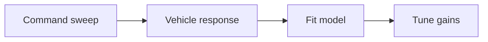

# System Identification for Better Control

System identification (SysID) uses recorded data to estimate the true dynamics of your vehicle. These models produce better control gains and reveal hidden coupling.

## What You Can Identify

- Motor time constants and latency.
- Body rates response to torque input.
- Thrust curve parameters.
- Drag coefficients.

## Typical Workflow

1. Inject a known input (step, chirp, sine sweep).
2. Log IMU and actuator commands.
3. Fit a simple model (first or second order).
4. Tune PID gains based on the model.



## Example: Rate Loop Identification

A common model for body rate response is:

```
G(s) = K / (tau*s + 1)
```

Where:

- `K` is the steady-state gain.
- `tau` is the time constant.

Use `K` and `tau` to set PID gains with a desired bandwidth.

## Coupling to This Framework

In this framework, the data path is:

- Inputs arrive via the receiver in `src/vehicle/rov4_vehicle.cpp`.
- The controller emits `ControlOutput` in `src/controllers/rov_controller.cpp`.
- The actuator output writes via `IActuatorOutput` in `include/flight/actuators/actuators.h`.

You can add a logging layer between controller and actuators to capture:

- Commanded motor values.
- IMU body rates.
- Timestamped state estimates.

Suggested hook:

```cpp
// src/vehicle/rov4_vehicle.cpp
auto output = deps_.controller->Update(estimate.pose, setpoint, dt_s);
// Add logging here before actuators->Write(...)
```

## Practical Tip

If you do not have a dedicated logger, you can stream telemetry over UDP and analyze in Python or MATLAB. The key is accurate timestamps and synchronized data.
