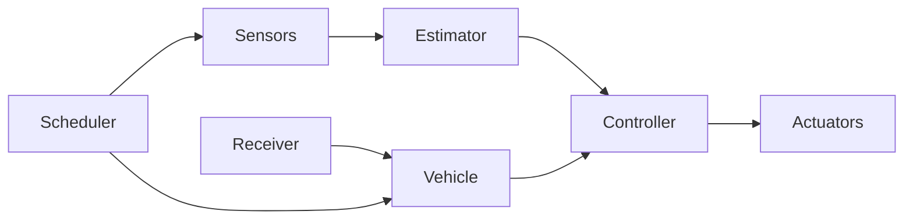
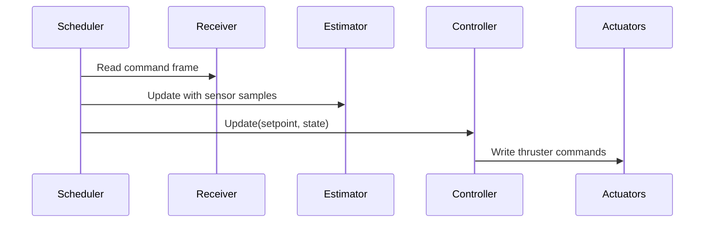

# Architecture

The framework is organized as a set of explicit interfaces and minimal implementations. All high‑level logic depends on interfaces, not concrete drivers, which keeps the code portable across MCU families.

## Layers
- **Core types**: `Vector3f`, `Quaternionf`, `Pose`, `TimestampUs`.
- **HAL**: time, flash, I2C/SPI/UART, GPIO.
- **Sensors**: IMU, barometer, magnetometer, GPS.
- **Estimators**: state estimation (Madgwick, Mahony, EKF, etc.).
- **Controllers**: produce actuator commands from state + setpoint.
- **Actuators**: PWM, DShot, CAN ESC, or other output protocols.
- **Receiver**: input sources (ELRS, SBUS, UDP).
- **Scheduler**: periodic task execution at different rates.
- **Vehicle**: composition of estimator, controller, actuators, receiver.

## System Flow

## Dependency Rules
- Vehicle orchestrates estimator/controller/actuators.
- Drivers depend only on HAL and core types.
- No driver depends on a specific MCU outside the HAL boundary.

## Extending to New MCUs
1. Implement HAL interfaces for the new MCU.
2. Provide sensor/receiver/actuator drivers using that HAL.
3. Reuse estimators/controllers/vehicle logic unchanged.

## ROV Control Loop

