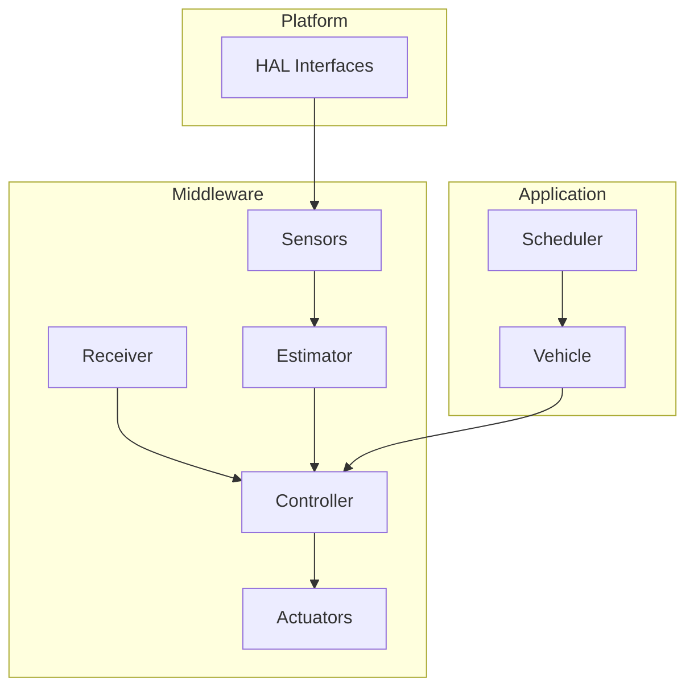

# Overview

makeflight is a modular C++17 flight controller framework. It emphasizes clean interfaces, testability, and portability across microcontrollers. The initial target is RP2350 with a 4‑thruster ROV reference vehicle.

## Design Goals
- Explicit HAL boundaries to isolate MCU‑specific drivers.
- Swappable modules for sensors, estimators, controllers, receivers, and actuators.
- Simple scheduler with deterministic loop rates.
- Vehicle composition and configuration for multiple archetypes.

## What’s Included
- HAL interfaces (`ITime`, `IFlash`, `II2c`, `ISpi`, `IUart`, `IGpio`).
- Sensor interfaces and initial MPU6050 driver.
- Estimator interfaces and a Madgwick stub.
- ROV mixer/controller and Biheli PWM output stub.
- UDP receiver for command input (host dev).

## Documentation
- API docs: generated via Doxygen.
- Human‑readable docs: MkDocs (this site).

## Architecture Snapshot

